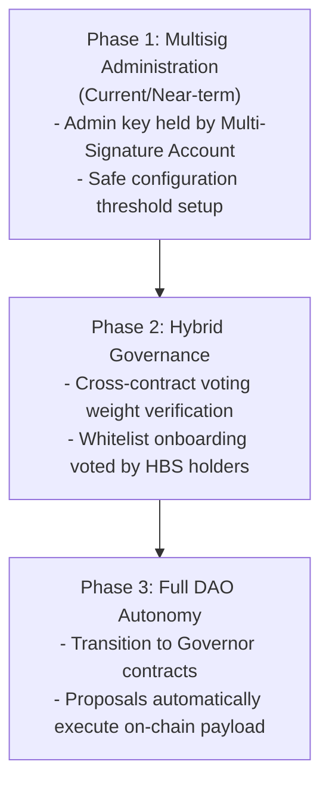

# Governance Model

This document outlines the governance model of the Heliobond platform, detailing the current administrative capabilities, whitelister roles, the voting mechanism, security considerations, future plans for decentralization, and community participation guidelines.

---

## Current Role-Based Access Control

Heliobond contracts distinguish between three primary roles: **Admin (Owner)**, **Whitelister**, and **Project Creators (Whitelisted)**. This structure is designed to decouple contract administration from operational tasks.

### 1. Admin (Owner)
The Admin role manages critical protocol configuration and capital allocation.
* **Implementation:** Employs the `stellar-access::ownable` single-owner pattern.
* **Ownership Transfer:** Follows a secure 2-step transfer process (`transfer_ownership` followed by `accept_ownership` from the new owner) to avoid accidental transfer to incorrect addresses.
* **Visibility:** Emits custom, project-specific `OwnershipTransferred` events in both contracts, ensuring that ownership change proposals are auditable off-chain.

#### Admin Capabilities

| Action | Contract | Description |
|---|---|---|
| `update_impact_score` | `ProjectRegistry` | Sets `credit_quality` and `green_impact` scores (0–100) for a project. |
| `update_credit_quality_score` | `ProjectRegistry` | Updates only the `credit_quality` score, preserving the existing `green_impact` score. |
| `certify_project` | `ProjectRegistry` | Updates the certification status of a registered project (shares this capability with the Whitelister). |
| `fund_project` | `InvestmentVault` | Disburses capital from the vault to the registered project creator's address. |
| `receive_yield` | `InvestmentVault` | Registers interest/yield payments received from project owners. |
| `claim_insurance` | `InvestmentVault` | Authorizes default insurance payouts to affected investors from the insurance reserve. |
| `set_management_fee` | `InvestmentVault` | Sets the vault management fee (hard-capped at 5.00% / 500 bps). |
| `enable_secondary_trading` | `InvestmentVault` | Enables DEX listing discovery and updates official secondary market listing status. |
| `pause` / `unpause` | Both | Temporarily freezes deposits, withdrawals, and proposal voting under emergency conditions. |

### 2. Whitelister
An operational role focused on onboarding project creators and certifying projects. Separating this role prevents daily tasks from requiring the high-security Admin key.

#### Whitelister Capabilities

| Action | Contract | Description |
|---|---|---|
| `set_whitelist` | `ProjectRegistry` | Approves or revokes creator addresses, granting or denying project registration rights. |
| `certify_project` | `ProjectRegistry` | Updates the certification status of a registered project (shares this capability with the Admin). |

### 3. Project Creators (Whitelisted)
* Must be explicitly whitelisted by the Whitelister.
* Can call `create_project` to register new project metadata (IPFS URI and maturity date) on-chain.

---

## On-Chain Proposal & Voting Mechanism

To prepare the platform for future decentralization, a preliminary governance proposal system is built directly into the `ProjectRegistry` contract.

### 1. Proposal Creation (`create_proposal`)
* **Eligibility:** Any whitelisted address may propose a governance change.
* **Parameters:** Requires a text description and a voting period.
* **Constraint:** The voting duration must be at least `MIN_VOTING_PERIOD` (86,400 seconds / 24 hours) to prevent flash proposals.

### 2. Casting Votes (`cast_vote`)
* **Eligibility:** Any token holder can vote.
* **Mechanism:** Votes are cast as either `support` (for) or `against`.
* **Voting Weight:** A voter's weight corresponds to their HBS (Heliobond Shares) balance.

> [!WARNING]
> **On-Chain Voting Weight Limitation**
>
> In the current version, the `cast_vote` function takes the vote `weight` as a direct parameter supplied by the caller, **without verifying it against the actual HBS token balance on-chain**.
>
> * **Current Mitigation:** Off-chain clients and indexers must query the `InvestmentVault` contract via `balance(voter)` during simulation and submit the correct value. Any proposal executed with invalid or inflated vote weights must be filtered out or rejected during off-chain validation before executing any manual steps.
> * **Future Fix:** A cross-contract call from `ProjectRegistry` to `InvestmentVault::balance(voter)` will be integrated into `cast_vote` to enforce the voting weight programmatically.

### 3. Proposal Execution (`execute_proposal`)
* **Eligibility:** Anyone may trigger execution once the voting period has elapsed.
* **Rule:** The proposal passes if `votes_for > votes_against`.
* **State Change:** The proposal is marked as `executed` to prevent double-execution or late voting.
* **Impact:** In the current phase, proposal execution is informational/social (signaling consensus) and does not automatically trigger state changes in contract configurations.

---

## Future Governance & Decentralization Roadmap

As the platform matures, governance will transition from centralized control to a community-led DAO structure:

1. **Multisig Control (Phase 1):** The single owner address of both contracts will be assigned to a Stellar multi-signature account. This requires multiple keys to sign any administrative transaction (like `fund_project` or `update_impact_score`), eliminating single points of failure.
2. **On-Chain Verification (Phase 2):** Integrate cross-contract checks in `cast_vote` to fetch and verify `weight` from the HBS token contract.
3. **Autonomous DAO (Phase 3):** Transition to a decentralized Governor contract architecture. Under this model, passed proposals will programmatically execute payload transactions (e.g., updating interest rates, changing whitelisters) without relying on a centralized administrator to perform the transaction.

---

## Community Participation Guidelines

Community members can participate in Heliobond governance through the following channels:

* **Holding HBS:** Acquisition of HBS shares grants voting power. The larger your share of the pool, the more influence your votes carry.
* **Submitting Proposals:** Whitelisted creators can propose updates to the protocol rules, fees, or whitelisting guidelines.
* **Auditing Protocol Operations:** Because every governance action emits structured events (`ProposalCreated`, `VoteCast`, `ProposalExecuted`, `OwnershipTransferred`), users can run independent indexers to monitor and verify all administrative decisions.
